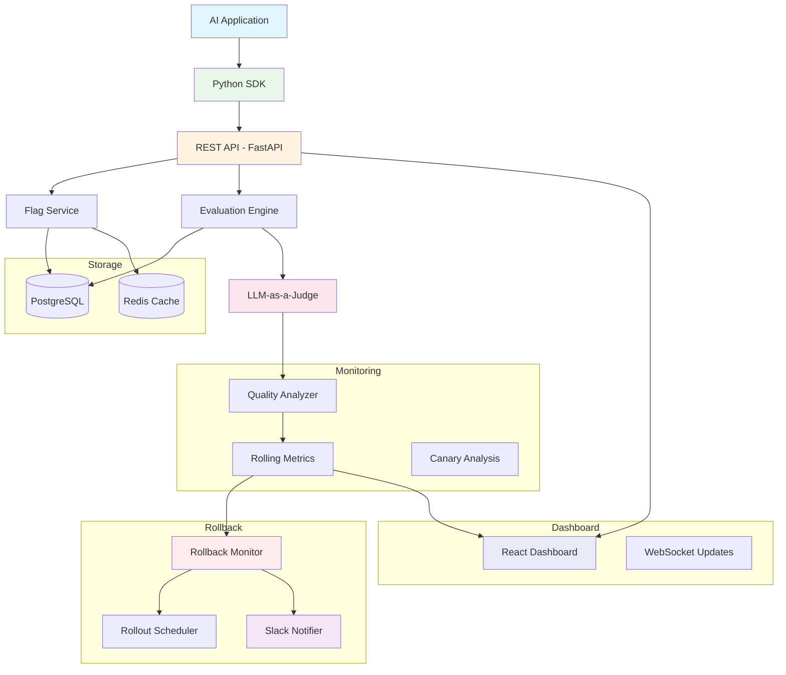
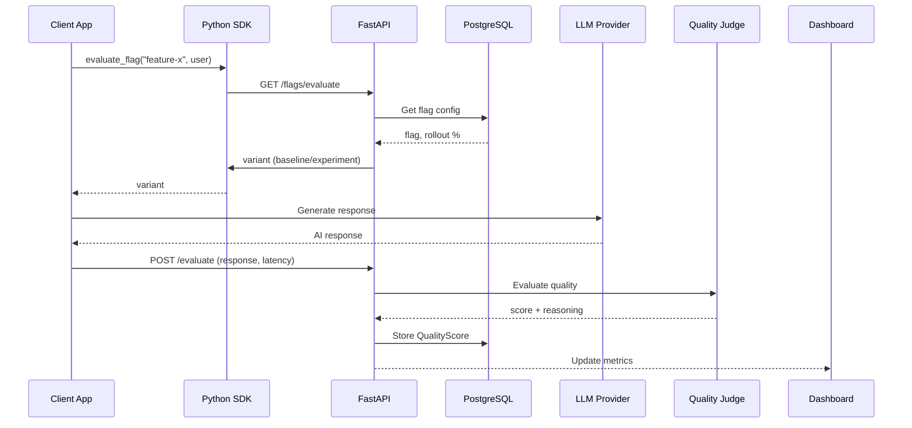
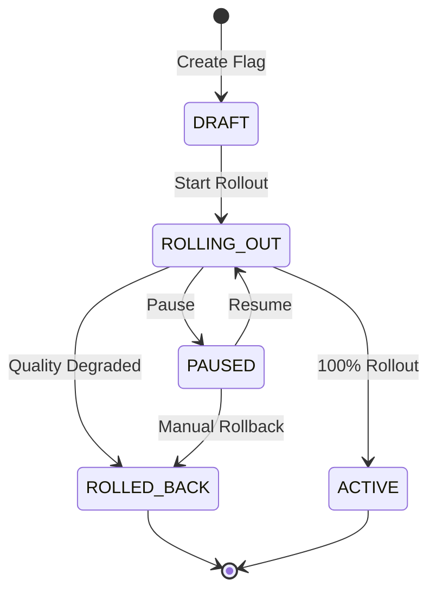
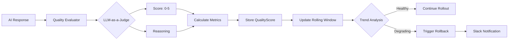
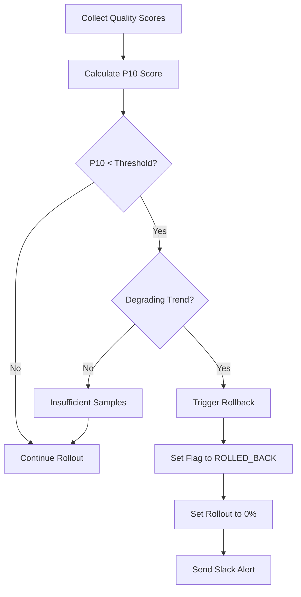
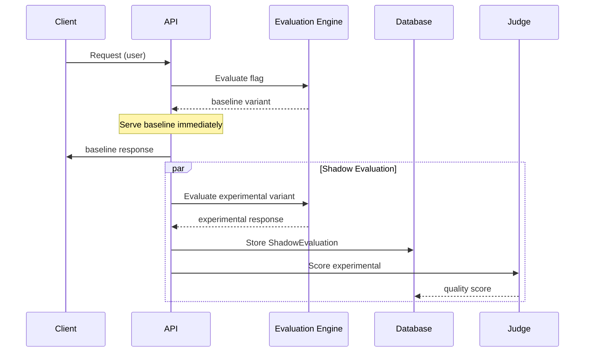

# AI Feature Flag Platform

> Automated AI Rollout, Quality Monitoring & Intelligent Rollback Platform

[](https://python.org)
[](https://fastapi.tiangolo.com)
[](https://react.dev)
[](https://postgresql.org)
[](https://redis.io)
[](https://docker.com)
[](LICENSE)

---

## Overview

Deploying AI applications is fundamentally different from deploying traditional software. While conventional feature flag systems can gradually enable or disable features, they cannot determine whether an AI system is still producing high-quality responses.

**AI Feature Flags** solves this problem by continuously evaluating AI-generated responses in production, monitoring quality metrics in real time, and automatically rolling back AI features whenever their performance falls below configurable thresholds.

### Key Capabilities

- **AI-native Feature Flag Management** — Version-controlled prompts and models as deployable flags
- **Percentage-Based Rollouts** — Gradually shift traffic from 0% to 100%
- **Deterministic User Bucketing** — Consistent assignment so users always see the same variant
- **LLM-as-a-Judge Evaluation** — Automated quality scoring using configurable judge providers
- **Real-Time Quality Monitoring** — Streaming dashboard with rolling metrics
- **Canary Analysis** — Statistical comparison between baseline and experimental variants
- **Shadow Mode** — Evaluate experimental responses without impacting users
- **Automatic Rollback** — Quality degradation triggers instant rollback with Slack notification
- **Python SDK** — Simple client library for flag evaluation and variant routing

---

## Architecture



### Request Flow



### Rollout Lifecycle



### Quality Evaluation Pipeline



### Automatic Rollback



### Shadow Mode



---

## Features

| Feature | Description | Status |
|---------|-------------|--------|
| Feature Flag CRUD | Create, read, update, delete AI feature flags | ✅ |
| Percentage Rollouts | Gradual traffic shifting from 0% to 100% | ✅ |
| Deterministic Bucketing | Consistent user-to-variant assignment via hashing | ✅ |
| LLM Provider Abstraction | OpenAI, OpenRouter, or custom providers | ✅ |
| LLM-as-a-Judge | Automated quality scoring (MockJudge or LLM Judge) | ✅ |
| Quality Metrics | Rolling average, P10, standard deviation, trend analysis | ✅ |
| Canary Analysis | Statistical comparison of baseline vs experiment | ✅ |
| Shadow Mode | Evaluate experimental in background without user impact | ✅ |
| Automatic Rollback | Quality degradation triggers instant rollback | ✅ |
| Slack Notifications | Rollback alerts via Slack webhook | ✅ |
| Rollout Scheduler | Automatic progression through rollout stages | ✅ |
| React Dashboard | Real-time monitoring with live updates | ✅ |
| Python SDK | Client library for flag evaluation | ✅ |
| Analytics | Quality trends, latency, error rates over time | ✅ |
| Demo Application | AI Email Assistant with good/bad modes | ✅ |

---

## Quick Start

### Prerequisites

- Python 3.11+
- Node.js 20+
- Docker & Docker Compose (for PostgreSQL and Redis)

### 1. Start Infrastructure

```bash
docker compose up -d
```

This starts PostgreSQL on port 5433 and Redis on port 6379.

### 2. Configure Environment

Copy the default `.env` file and configure your API keys:

```bash
# Edit .env with your API keys
# At minimum, set one of:
#   - OPENAI_API_KEY=sk-...  (for OpenAI)
#   - OPENROUTER_API_KEY=sk-or-...  (for OpenRouter)
```

### 3. Install Backend & Run

```bash
pip install -r requirements.txt
uvicorn apps.flags_service.main:app --reload --port 8000
```

### 4. Install Frontend & Run

```bash
cd frontend
npm install
npm run dev
```

### 5. Open the Application

| URL | Description |
|-----|-------------|
| http://localhost:5173 | Main Dashboard |
| http://localhost:5173/demo | AI Email Assistant Demo |
| http://localhost:5173/flags | Feature Flag Management |
| http://localhost:5173/rollouts | Rollout Management |
| http://localhost:5173/quality | Quality Monitoring |
| http://localhost:5173/canary | Canary Analysis |
| http://localhost:5173/rollbacks | Rollback History |
| http://localhost:8000/docs | API Documentation (Swagger) |

### 6. Run the Automated Demo

```bash
python scripts/demo.py
```

This script automatically:
1. Resets the demo
2. Creates a feature flag
3. Starts rollout at 1%
4. Generates normal AI traffic
5. Advances rollout to 25%
6. Generates intentionally poor responses
7. Demonstrates quality degradation
8. Shows final dashboard state

---

## Docker Deployment

One-command deployment:

```bash
docker compose up --build -d
```

This starts six services:

| Service | Description | Port |
|---------|-------------|------|
| `postgres` | PostgreSQL database | 5433 |
| `redis` | Redis cache | 6379 |
| `backend` | FastAPI application | 8000 |
| `frontend` | React dashboard | 5173 |
| `quality-worker` | Background quality evaluation | — |
| `rollout-worker` | Background rollout scheduling | — |

### Production Environment Variables

```env
# Database
POSTGRES_USER=postgres
POSTGRES_PASSWORD=<strong-password>
POSTGRES_DB=feature_flags
POSTGRES_HOST=postgres
POSTGRES_PORT=5432

# LLM Provider
LLM_PROVIDER=openrouter
OPENROUTER_API_KEY=<your-key>
OPENROUTER_MODEL=openai/gpt-4.1-mini
OPENROUTER_BASE_URL=https://openrouter.ai/api/v1

# LLM-as-a-Judge
JUDGE_PROVIDER=mock          # mock for dev, openrouter for prod
JUDGE_API_KEY=<your-key>
JUDGE_MODEL=openai/gpt-4.1-mini
JUDGE_BASE_URL=https://openrouter.ai/api/v1

# Slack Notifications
NOTIFIER_PROVIDER=slack
SLACK_WEBHOOK_URL=https://hooks.slack.com/services/...

# Rollback Configuration
QUALITY_THRESHOLD=4.0
MINIMUM_SAMPLE_SIZE=50
ROLLBACK_COOLDOWN_MINUTES=30
```

---

## Demo Application — AI Email Assistant

The platform includes an interactive **AI Email Assistant** demo that showcases all feature flag capabilities end-to-end.

### Features Demonstrated

- Feature flag evaluation via SDK
- Prompt versioning (baseline vs experimental)
- Percentage-based rollouts
- Quality monitoring with LLM-as-a-Judge
- Automatic rollback on quality degradation
- Real-time dashboard updates

### Demo Modes

| Mode | Description |
|------|-------------|
| **Normal Demo** | Uses good experimental prompt. As rollout % increases, more users see the improved variant. |
| **Bad Demo** | Uses deliberately poor prompt (emojis only). Quality drops and triggers automatic rollback. |
| **Reset** | Deletes all demo evaluations, resets flag to draft, clears dashboard metrics. |

### API Endpoints

| Endpoint | Method | Description |
|----------|--------|-------------|
| `/demo/generate` | POST | Generate email with normal prompts |
| `/demo/bad-generate` | POST | Generate email with deliberately bad prompt |
| `/demo/status` | GET | Current demo state (flag, evaluations, quality) |
| `/demo/reset` | POST | Reset demo to initial state |

---

## Python SDK

### Installation

```bash
pip install ai-flags-sdk
```

Or use directly from the SDK directory:

```python
import sys
sys.path.append("sdk/python")
```

### Usage

```python
from ai_flags.client import AIClient

client = AIClient(
    base_url="http://localhost:8000",
    api_key="optional-api-key",
)

# Evaluate a feature flag
variant = client.evaluate_flag(
    flag_name="ai-email-assistant",
    user_id="user-123",
    context={"role": "premium"},
)

if variant == "experiment":
    # Use the experimental prompt/model
    response = generate_with_experimental_prompt()
else:
    # Use the baseline prompt/model
    response = generate_with_baseline_prompt()

# Report quality back
client.report_quality(
    flag_name="ai-email-assistant",
    user_id="user-123",
    variant=variant,
    response=response,
    latency_ms=450,
)
```

### SDK Reference

| Method | Description |
|--------|-------------|
| `evaluate_flag(name, user_id, context)` | Evaluate which variant a user should see |
| `report_quality(name, user_id, variant, response, latency_ms)` | Report generation quality |
| `get_flag(name)` | Get flag configuration |
| `list_flags()` | List all available flags |

---

## API Reference

### Flags

#### `POST /flags` — Create a Feature Flag

```json
{
  "name": "ai-email-assistant",
  "description": "AI email generation feature",
  "baseline_variant": "gpt-4-prompt-v1",
  "experimental_variant": "gpt-4-prompt-v2",
  "quality_threshold": 60.0
}
```

**Response** `201 Created`
```json
{
  "id": "uuid",
  "name": "ai-email-assistant",
  "status": "draft",
  "rollout_percentage": 0,
  "quality_threshold": 60.0
}
```

#### `GET /flags` — List All Flags

Returns all feature flags with their current status and rollout percentage.

#### `GET /flags/{id}` — Get Flag Details

Returns detailed information about a specific flag.

#### `PATCH /flags/{id}` — Update Flag

Update flag configuration (name, description, threshold, etc.).

#### `DELETE /flags/{id}` — Delete Flag

Permanently delete a flag and all associated data.

### Rollouts

#### `POST /flags/{id}/rollout` — Start Rollout

```json
{
  "percentage": 25,
  "actor": "deploy-bot",
  "reason": "Canary phase 1"
}
```

#### `POST /flags/{id}/pause` — Pause Rollout

#### `POST /flags/{id}/resume` — Resume Rollout

#### `POST /flags/{id}/rollback` — Rollback

### Dashboard

#### `GET /rollouts` — Active Rollouts

#### `GET /rollbacks` — Rollback History

#### `GET /canary` — Canary Analysis Results

#### `GET /quality/series` — Quality Time Series

#### `GET /quality/summary` — Quality Summary Statistics

#### `GET /shadow/tests` — Shadow Evaluation Results

#### `GET /shadow/overview` — Shadow Mode Overview

#### `GET /health/services` — System Health

### Error Responses

| Status | Description |
|--------|-------------|
| 400 | Invalid request (e.g., percentage out of range) |
| 404 | Flag not found |
| 409 | Flag name already exists |
| 422 | Validation error |

---

## Project Structure

```
ai-feature-flag-platform/
├── apps/
│   ├── demo_app/          # Demo application (router, service, LLM providers)
│   ├── flags_service/     # FastAPI backend (API, services, schemas)
│   ├── quality_worker/    # Background quality evaluation worker
│   └── rollout_worker/    # Background rollout scheduler worker
├── core/
│   ├── models/            # Domain models (flag, evaluation, targeting)
│   ├── quality/           # Quality engine (judge, evaluator, metrics, analyzer)
│   ├── queue/             # Queue abstraction (base, in-memory)
│   └── rollout/           # Rollout engine (canary, scheduler, shadow, statistics)
├── sdk/python/            # Python SDK (client, evaluator, cache, hashing)
├── infrastructure/
│   ├── cache/             # Redis cache client
│   └── database/          # SQLAlchemy models, repositories, session
├── notification/          # Notification providers (Slack, NoOp)
├── frontend/src/          # React dashboard (16 pages, components, services)
├── tests/                 # Unit and integration tests
├── docker-compose.yml     # Multi-service Docker deployment
├── Dockerfile             # Backend container image
└── scripts/               # Utility scripts
```

---

## Testing

```bash
# Run all tests
pytest

# Run with coverage
pytest --cov=apps --cov=core --cov=sdk --cov=infrastructure --cov=notification

# Run specific test categories
pytest tests/unit
pytest tests/integration
```

---

## Deployment

### Docker Compose (Recommended)

```bash
docker compose up --build -d
```

### Render

1. Create a new Web Service
2. Set build command: `pip install -r requirements.txt`
3. Set start command: `uvicorn apps.flags_service.main:app --host 0.0.0.0 --port 8000`
4. Add environment variables from `.env`

### Railway

```bash
railway login
railway init
railway up
```

### AWS EC2

```bash
# SSH into instance
ssh -i key.pem ec2-user@<instance-ip>

# Install Docker
sudo yum install -y docker
sudo service docker start

# Clone and run
git clone <repo-url>
cd ai-feature-flag-platform
docker compose up -d
```

---

## Future Improvements

- Multi-model support (evaluate multiple LLMs simultaneously)
- Prompt A/B testing and experimentation
- Human feedback integration for quality scoring
- Custom evaluation metrics and weights
- Grafana & Prometheus monitoring integration
- Kubernetes deployment with Helm charts
- Multi-tenant architecture with organization isolation
- Advanced analytics dashboard with export capabilities
- WebSocket-based real-time dashboard updates
- gRPC SDK for higher throughput

---

## License

This project is released under the MIT License.

---

## Author

**Atharv Singh**

AI Engineering • Machine Learning • Backend Systems • AI Infrastructure

- GitHub: [@Atharvsingh9](https://github.com/Atharvsingh9)
- LinkedIn: [Atharv Singh](https://www.linkedin.com/in/atharv-s-324102318/)
